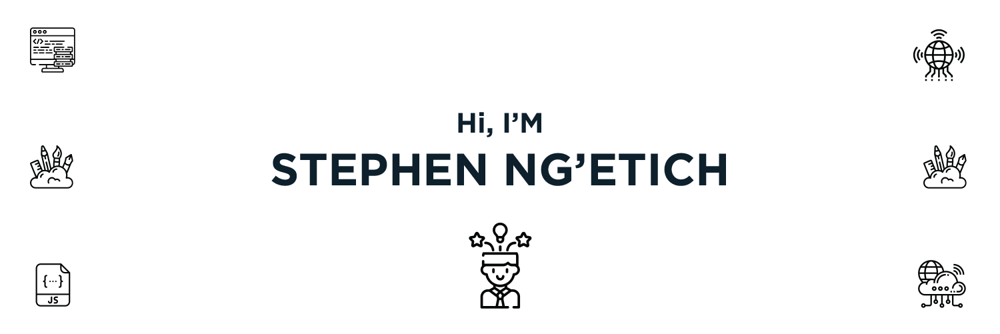

Hey there 👋

I'm Stephen Ng'etich, a fullstack engineer ,creative code and a self proclaimed designer. My mission is to deliver on solutions that impact our daily lives.

## **📝 Latest Blog Posts and Projects**
---
1. [Data analysis a sample survey secondary schools in Kenya donein 2019](https://github.com/skngetich/msc-dsa-mod-2/blob/main/sng'etich_assignment.ipynb)

## **Tool | Technologies | Frameworks I used**
---

 

 

 
